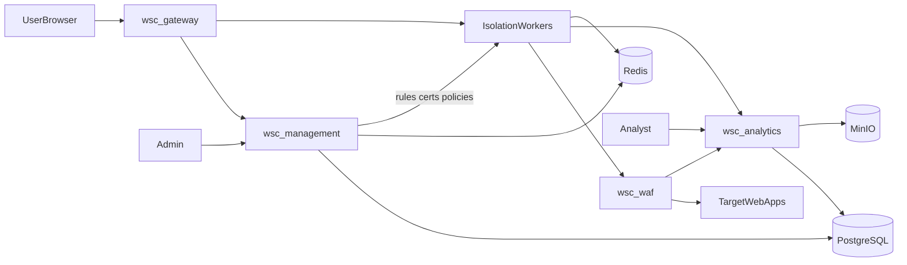

# Архитектура WSC

Описание системного контекста, потока данных и ключевых подсистем. Мастер-промпт для агентов вынесен в [master-prompt.md](master-prompt.md).

## Системный контекст

Три прикладных сервиса + WAF-sidecar + инфраструктура в Docker:

| Сервис | Назначение |
|--------|------------|
| **wsc-gateway** | Портал (sidebar), каталог, Browser Isolation (Chromium/Playwright), стрим UI, app-idle, URL masking |
| **wsc-waf** | Sidecar: OpenResty/Nginx + ModSecurity 3 + OWASP CRS; только из gateway |
| **wsc-management** | Пользователи, RBAC, приложения, TLS, правила ModSecurity, интеграции |
| **wsc-analytics** | Запись сеансов, скриншоты, WAF events, отчёты |
| **postgres** | Данные, audit, метаданные WAF events |
| **redis** | Сессии, очереди BullMQ, pub/sub hot-reload WAF |
| **minio** | Скриншоты, артефакты записи |

Edge (Traefik/Caddy): маршруты `portal.*`, `admin.*`, `analytics.*`. Целевые приложения снаружи не публикуются.

## Стек

| Слой | Технология |
|------|------------|
| Monorepo | pnpm + Turborepo |
| UI | Next.js + React + TypeScript + `@wsc/ui` |
| API | NestJS 11 + Fastify |
| Isolation | Playwright/Chromium на gateway |
| WAF | ModSecurity 3 + OWASP CRS (sidecar); перспектива: Coraza-compatible |
| DB | PostgreSQL |
| Cache/queues | Redis + BullMQ |
| Object storage | MinIO (S3 API) |
| Auth | Единый IdP-модуль, TOTP, AD/LDAP, OIDC/SAML |
| Deploy | Docker Compose (dev/stage) |

## UX портала

1. После login — **portal shell**: sidebar + content area.
2. Sidebar: Приложения, Активные сессии, Профиль (и пункты по RBAC).
3. Выбор приложения → **in-app workspace** (не новое окно). Кнопка «Назад к каталогу».
4. **App-idle** отключает только сессию к target; портал и SSO остаются.
5. **Portal-idle** — отдельная глобальная политика logout.
6. **WAF block** — брендированная safe-page внутри workspace.
7. Скриншоты и запись — на сервере, без заметного клиентского агента.

## URL masking

- Пользователь видит только URL шлюза: `https://<gateway>/workspace/<opaqueId>/...` или `/a/<slugHash>/...`.
- Реальный hostname/path target не показывается в UI, title (sanitize), clipboard (если запрещено), metadata загрузок.
- В isolation нет адресной строки удалённого браузера.
- SSRF guard: upstream только из allowlist приложения; блок link-local / metadata IP.
- Аналитик видит target URL; end-user — нет.
- Запрещено: redirect на origin target; bypass WAF; утечка URL через client JS (только stream).

## Browser Isolation (вариант A)

1. При открытии приложения создаётся `AppSession` с opaque id.
2. Chromium на gateway; клиент получает стрим (WebRTC/WebSocket + canvas/video).
3. Весь HTTP(S) из isolation → `http://wsc-waf:8080/upstream/{appId}/...` → target.
4. Скриншоты: периодические + on navigation/click + on WAF block; политика per-app.
5. Cookie jar изолирован между приложениями.

## WAF

### Поток

1. Request/response через ModSecurity + CRS.
2. Режимы per-app: `Off` | `DetectionOnly` | `Prevent`.
3. CRS paranoia 1–4, anomaly threshold, custom SecLang, exclusions.
4. Block → 403/406, `WafEvent` в analytics, optional screenshot, optional kill app-session / temp ban.
5. Management **publish** → hot-reload на gateway (API + Redis pub/sub).

### SQLi / XSS

- **SQLi:** CRS Prevent — блок до target.
- **Reflected XSS:** query/body/headers — CRS XSS rules.
- **Stored XSS (write):** request-side CRS при сохранении payload.
- **Stored XSS (read):** optional response body inspection (per-app, осторожно с perf).
- **DOM XSS:** WAF ограничен; mitigation — Browser Isolation (код target не в браузере пользователя).
- **Upload XSS:** multipart CRS + upload policy (MIME, size, extensions).

### Management UI (WAF)

- **WAF → Global profile:** версия CRS, default paranoia, default mode.
- **App → Security → WAF:** mode, paranoia, rules on/off, custom rules, exclusions, dry-run, versioning, rollback, sync status.

## TLS / сертификаты (per-app)

- Upstream: `http` | `https` | `https+mtls`.
- Upload: CA PEM, client cert/key (PEM/P12), trust mode, verify on/off (off = lab + audit warning).
- Min TLS, SNI override; мониторинг expiry и alerts.
- Health-check использует те же TLS settings.
- Edge-сертификат портала WSC отделён от upstream certs приложений.
- Хранение encrypted-at-rest; в UI после save — fingerprint/expiry only.

## Настройки per-app (management)

Internal upstream URL (только admin) / health-check / allowed hosts; opaque route key; Browser Isolation; upstream TLS; WAF profile; target auth (none | form-fill | header injection | OAuth-on-behalf); app idle + warning; screenshot policy; retention записи; clipboard / download / upload / print; watermark; IP/time/geo; max concurrent sessions; SSO mapping; custom headers / CSP; audit verbosity; launch ACL.

## Analytics

- Timeline сеанса: connect → actions → WAF hits → disconnect
- Галерея скриншотов, коррелированная с событиями
- Отчёты по user/app/period; WAF dashboard
- Export CSV/PDF; retention policies
- Stealth recording: без видимых индикаторов для пользователя

## Безопасность и RBAC

RBAC + ABAC hooks; TOTP; password policy / lockout / revoke; AD/LDAP; SMTP alerts; append-only audit + WAF store; SIEM (syslog / webhooks); permissions `waf.manage`, `certs.manage`.

## Интеграции

AD/LDAP (LDAPS), OIDC / SAML 2.0, SMTP / SMTPS, syslog / webhooks / HEC-like, REST Management API + API keys, SCIM (фаза 2), backup: Postgres + MinIO + WAF rule packs + cert store.

## Доменная модель (ядро)

`User`, `Group`, `Role`, `Permission`, `Application`, `AppPolicy`, `AppCertificate`, `AppLaunchAcl`, `PortalSession`, `AppSession`, `Screenshot`, `SessionEvent`, `SessionRecording`, `WafProfile`, `WafRulePack`, `WafExclusion`, `WafEvent`, `AuditLog`, `IntegrationConfig`, `Report`, `RetentionPolicy`.

## Фазы поставки

| Фаза | Scope |
|------|--------|
| **M1** | Monorepo, Compose, auth shell, portal sidebar, каталог stub, isolation POC |
| **M2** | URL masking, app-session idle, screenshots → MinIO |
| **M3** | WAF sidecar CRS Prevent, WAF events → analytics |
| **M4** | Management: apps, TLS upload, WAF editor, publish/sync |
| **M5** | Analytics UI, reports, SIEM export |
| **M6** | AD/LDAP, OIDC/SAML, TOTP hardening, DLP (optional) |

## Явные non-goals

- Не открывать target apps в новом окне/вкладке как основной UX.
- Не ставить клиентский spyware/extension для записи.
- Не рвать portal SSO только из-за app-idle.
- Не показывать target URL end-user.
- Не позволять isolation-браузеру обходить WAF к upstream.

## Переменные окружения (справка)

Ключевые группы: `DATABASE_URL`, `REDIS_URL`, `MINIO_*`, `JWT_*`, `WAF_SIDECAR_URL`, `GATEWAY_PUBLIC_URL`, `MANAGEMENT_INTERNAL_URL`.
