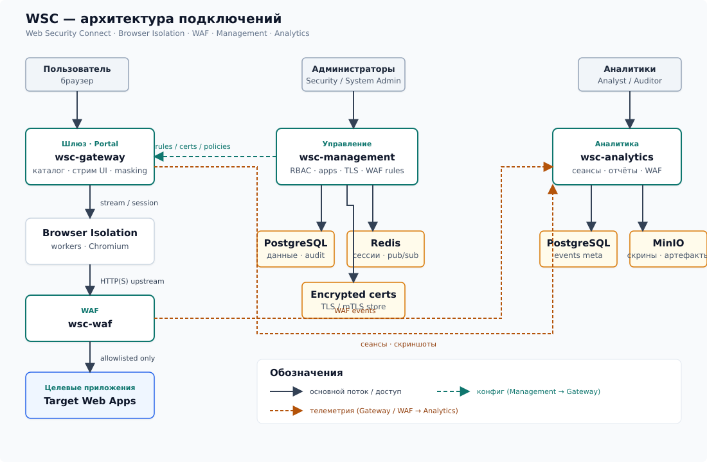

# WSC — описание продукта

## Что это

**WSC (Web Security Connect)** — платформа безопасного доступа к внутренним веб-приложениям и control plane для политик этого доступа.

Организации сталкиваются с привычным риском: чувствительные системы (панели администрирования, CRM, мониторинг, внутренние порталы) либо публикуются шире необходимого, либо остаются без единой точки контроля. WSC выносит доступ в управляемый контур: пользователь работает через корпоративный портал, а целевые приложения остаются за шлюзом — без прямой публикации URL наружу.

Архитектурно WSC разделяет плоскости:

- **плоскость доступа** — портал, Browser Isolation, маршрутизация к upstream;
- **плоскость контроля** — управление приложениями, RBAC, TLS, политиками WAF;
- **плоскость видимости** — сеансы, скриншоты, события WAF, отчётность и аудит.

Целевые приложения снаружи не публикуются. Edge (Traefik/Caddy) обслуживает контуры `portal.*`, `admin.*`, `analytics.*`; весь HTTP(S) к upstream идёт только через gateway и WAF-sidecar.

## Для чего

WSC закрывает конкретные задачи безопасности и соответствия, не требуя клиентских агентов и не ломая привычный сценарий «открыл приложение — поработал».

**Снижение поверхности атаки.** Внутренние веб-системы не выставляются как отдельные публичные origin. Пользователь видит только URL шлюза; реальный hostname и path target скрыты (URL masking). Upstream берётся из allowlist приложения; link-local и metadata-адреса блокируются.

**Единая политика доступа.** Приложения, ACL запуска, idle-таймауты, clipboard/download/upload, watermark, ограничения по IP/времени/гео — настраиваются централизованно. Принцип наименьших привилегий реализуется через RBAC (и хуки ABAC), а не через «раздали VPN всем».

**Контроль сеанса без поломки UX.** Интерфейс target стримится с удалённого Chromium на gateway. Код целевого приложения не исполняется в браузере пользователя. **App-idle** завершает только сессию к приложению; портал и SSO остаются. **Portal-idle** — отдельная, более длинная политика logout.

**WAF на краю доступа.** Весь трафик isolation → upstream обязан пройти через ModSecurity + OWASP CRS. Режимы per-app: `Off` | `DetectionOnly` | `Prevent`. Блок показывает брендированную safe-page внутри workspace; событие фиксируется в аналитике.

**Соответствие и аудиторский след.** Сеансы, timeline действий, скриншоты, WAF events и append-only audit log дают материал для расследований, отчётов и экспорта в SIEM (syslog / webhooks). Запись ведётся на сервере — без клиентского расширения и без раскрытия target URL end-user.

## Как работает

Поток доступа выстроен как цепочка контроля: **портал → Browser Isolation → WAF → целевое приложение**. Управление публикует конфигурацию на gateway; аналитика записывает то, что произошло.

Подробная схема и доменная модель — в [Архитектура](arkhitektura.md); краткий обзор компонентов — в [Обзор](obzor.md); зафиксированные решения — в [Решения](resheniya.md).

### Поток пользователя

1. Единый вход (IdP-модуль: локальная учётка / AD/LDAP / OIDC/SAML, при необходимости TOTP).
2. После авторизации — **переключатель контуров** по правам: Portal / Management / Analytics.
3. В портале — shell со sidebar (Приложения, Активные сессии, Профиль и пункты по RBAC) и область контента.
4. Выбор приложения открывает **in-app workspace** внутри портала, не новую вкладку браузера. Есть возврат к каталогу.
5. На gateway создаётся `AppSession` с opaque id; поднимается Chromium (Playwright). Клиент получает стрим UI (WebRTC/WebSocket).
6. Весь HTTP(S) из isolation идёт в `wsc-waf`, затем к allowlisted upstream. Cookie jar изолирован между приложениями.
7. Пользователь видит только URL шлюза (`/workspace/<opaqueId>/...` или `/a/<slugHash>/...`). В isolation нет адресной строки удалённого браузера; origin target не утекает в UI, title, clipboard (если запрещено) и metadata загрузок.

### Idle и инциденты

| Событие | Поведение |
|---------|-----------|
| **App-idle** | Завершается только `AppSession`; портал и SSO живы |
| **Portal-idle** | Logout с портала по отдельной политике |
| **WAF block** | Safe-page внутри workspace; `WafEvent` → analytics; опционально скриншот / kill session |

### Плоскость управления

В **Management** администраторы регистрируют приложения (internal upstream, health-check, opaque route), загружают per-app TLS (в т.ч. mTLS), настраивают профиль WAF (paranoia, exclusions, custom SecLang) и публикуют изменения. Publish доходит до gateway через API и Redis pub/sub (hot-reload). Edge-сертификат портала отделён от upstream-сертификатов приложений; секреты хранятся encrypted-at-rest.

### Плоскость видимости

**Analytics** строит timeline сеанса (connect → действия → WAF hits → disconnect), галерею скриншотов (по политике per-app: периодические, на навигацию/клик, на блок WAF), отчёты и экспорт. Аналитик может видеть target URL; end-user — нет. Целевые приложения снаружи недоступны: трафик к ним возможен только из контура gateway → WAF.

## Роли

Доступ разделён по контурам и ролям. Вход один; переключатель контуров показывает только то, на что есть права. Дизайн единый (`@wsc/ui`).

| Роль | Контур | Что делает |
|------|--------|------------|
| **End User** | Portal | Входит в каталог, запускает разрешённые приложения, работает в workspace, видит свои активные сессии и профиль. Не видит real URL target и не обходит WAF. |
| **App Owner** | Management | Владеет конкретными приложениями: upstream, health-check, политики сеанса (idle, clipboard, screenshots), ACL запуска в рамках делегированных прав. |
| **Security Admin** | Management | Задаёт политики безопасности: WAF-профили, режимы Prevent/DetectionOnly, exclusions, DLP-ограничения UI, разрешения вроде `waf.manage` / `certs.manage`. |
| **System Admin** | Management | Инфраструктурный контур платформы: пользователи и группы, IdP (AD/LDAP, OIDC/SAML), TLS store, интеграции (SMTP, SIEM), системные параметры. |
| **Analyst** | Analytics | Расследует сеансы: timeline, скриншоты, корреляция с WAF events, оперативные дашборды. |
| **Auditor** | Analytics | Читает отчёты, retention, audit trail; экспорт для внешнего контроля. Изменения конфигурации — вне зоны роли. |

На практике один человек может совмещать роли (например, Security Admin + Analyst): после login он переключается между Management и Analytics без повторной аутентификации, в пределах выданных привилегий.

---

Смежные материалы: [Обзор](obzor.md) · [Архитектура](arkhitektura.md) · [Зафиксированные решения](resheniya.md) · [Окружение](okruzhenie.md)
