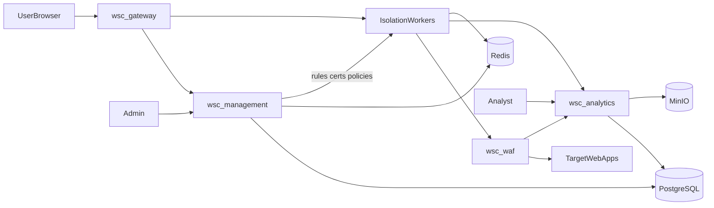

# WSC — Web Security Connect

> **Русская документация:** актуальный набор — [`docs/ru/`](ru/) (обзор, архитектура, мастер-промпт, окружение, решения). Этот файл сохранён как исходник / legacy.

Архитектура, требования и **мастер-промпт** для реализации платформы.

---

## 1. Product vision

**WSC (Web Security Connect)** — корпоративная платформа безопасного доступа к внутренним WEB-приложениям через единый портал. Пользователь работает с целевыми системами (Wazuh, CRM, панели администрирования и т.д.) **внутри WSC**, без раскрытия реальных URL. Весь трафик проходит через шлюз с **Browser Isolation** и **WAF (ModSecurity + OWASP CRS)**. Администраторы настраивают приложения, политики, сертификаты и правила; аналитики просматривают сеансы, скриншоты и инциденты WAF.

---

## 2. Personas и роли

| Роль | Контур | Возможности |
|------|--------|-------------|
| **End User** | Portal (gateway) | Каталог приложений, in-app workspace, свои сессии |
| **App Owner** | Management | Приложения, привязки пользователей, per-app политики (ограниченно) |
| **Security Admin** | Management | WAF, сертификаты, глобальные политики, `waf.manage`, `certs.manage` |
| **System Admin** | Management | Пользователи, AD/LDAP, SMTP, интеграции, RBAC |
| **Analyst** | Analytics | Сеансы, скриншоты, отчёты, WAF timeline |
| **Auditor** | Analytics (read-only) | Экспорт audit / compliance |

**Единое окно авторизации:** один login; после входа — **переключатель ролей/контуров** (Portal / Management / Analytics) по правам пользователя. Одинаковый дизайн (`@wsc/ui`) во всех контурах.

---

## 3. System context

Три прикладных сервиса + инфраструктура в Docker:



| Сервис | Назначение |
|--------|------------|
| **wsc-gateway** | Портал (sidebar), каталог приложений, Browser Isolation (Chromium/Playwright), стрим UI, idle app-session, URL masking |
| **wsc-waf** | Sidecar: OpenResty/Nginx + ModSecurity 3 + OWASP CRS; только из gateway |
| **wsc-management** | Пользователи, RBAC, приложения, TLS, ModSecurity rules, интеграции |
| **wsc-analytics** | Запись сеансов, скриншоты, WAF events, отчёты |
| **postgres** | Данные, audit, WAF events metadata |
| **redis** | Сессии, очереди BullMQ, pub/sub hot-reload WAF |
| **minio** | Скриншоты, артефакты записи |

---

## 4. Stack lock (2026)

| Слой | Технология |
|------|------------|
| Monorepo | pnpm + Turborepo |
| UI | Next.js + React + TypeScript + `@wsc/ui` |
| API | NestJS 11 + Fastify |
| Isolation | Playwright/Chromium на gateway |
| WAF | ModSecurity 3 + OWASP CRS (sidecar); future: Coraza-compatible |
| DB | PostgreSQL |
| Cache/queues | Redis + BullMQ |
| Object storage | MinIO (S3 API) |
| Auth | Единый IdP-модуль, TOTP, AD/LDAP, OIDC/SAML |
| Deploy | Docker Compose (dev/stage); Traefik/Caddy edge |

---

## 5. UX портала (обязательно)

1. После login — **portal shell**: sidebar + content area.
2. Sidebar: Приложения, Активные сессии, Профиль (и пункты по RBAC).
3. Выбор приложения → **in-app workspace** (не новое окно браузера). Кнопка «Назад к каталогу».
4. **Idle timeout только app-session**: бездействие в viewer отключает сессию к target-приложению; портал и SSO остаются. Toast: «Сессия приложения завершена по бездействию».
5. **Portal-idle** (logout с портала) — отдельная глобальная политика, длиннее app-idle.
6. **WAF block** — branded safe-page **внутри workspace**, без ухода с портала.
7. Скриншоты и запись — на сервере, без заметного клиентского агента; не деградировать UX.

---

## 6. URL masking

- Пользователь видит только URL шлюза: `https://<gateway>/workspace/<opaqueId>/...` или `/a/<slugHash>/...`.
- Реальный hostname/path target (например Wazuh) **не** показывается в UI, title (sanitize), clipboard (если запрещено), metadata загрузок.
- В isolation **нет** адресной строки удалённого браузера.
- SSRF guard: upstream только allowlisted hosts из конфига app; блок link-local / metadata IP.
- Оператор в analytics видит target URL; end-user — нет.
- **Запрещено:** redirect пользователя на origin target; bypass WAF; leak URL через client JS (только stream).

---

## 7. Browser Isolation (вариант A)

1. `AppSession` с opaque id при открытии приложения.
2. Chromium на gateway; пользователь получает стрим (WebRTC/WebSocket + canvas/video pipeline).
3. Весь HTTP(S) из isolation → `http://wsc-waf:8080/upstream/{appId}/...` → target.
4. Скриншоты: периодические + on navigation/click + on WAF block; политика per-app.
5. Cookie jar **изолирован** между приложениями.

---

## 8. WAF (шлюз как WAF)

### Поток

1. Request/response через ModSecurity + CRS.
2. Режимы per-app: `Off` | `DetectionOnly` | `Prevent`.
3. CRS paranoia 1–4, anomaly threshold, custom SecLang, exclusions.
4. Block → 403/406, `WafEvent` в analytics, optional screenshot marker, optional kill app-session / temp ban.
5. Management **publish** → gateway hot-reload (API + Redis pub/sub).

### SQLi / XSS / прочее

- **SQLi:** CRS Prevent — блок до target (пример: `' OR 1=1` в Wazuh).
- **Reflected XSS:** query/body/headers — CRS XSS rules.
- **Stored XSS (write):** request-side CRS при сохранении payload.
- **Stored XSS (read):** optional response body inspection (per-app, perf caution).
- **DOM XSS:** WAF ограничен; mitigation — Browser Isolation (код target не в браузере пользователя).
- **Upload XSS:** multipart CRS + upload policy (MIME, size, extensions).

### Management UI

- **WAF → Global profile:** CRS version, default paranoia, default mode.
- **App → Security → WAF:** mode, paranoia, rules on/off, custom rules editor, exclusions wizard, test rule (dry-run), versioning, rollback, sync status.

---

## 9. TLS / сертификаты (per-app)

- Upstream: `http` | `https` | `https+mtls`.
- Upload: CA PEM, client cert/key (PEM/P12), trust mode, verify on/off (off = lab + audit warning).
- Min TLS version, SNI override; expiry monitoring и alerts.
- Health-check использует те же TLS settings.
- Edge cert портала WSC — отдельно от upstream app certs.
- Хранение encrypted-at-rest; UI после save — fingerprint/expiry only.

---

## 10. Per-app settings (management)

- Internal upstream URL (admin only) / health-check / allowed hosts
- Public opaque route key
- Access method: Browser Isolation (default)
- Upstream TLS + cert upload
- WAF profile + auto-action on critical block
- Target auth: none | form-fill | header injection | OAuth-on-behalf
- App idle timeout + warning seconds
- Screenshot policy (interval, events, quality, pause on idle)
- Recording retention
- Clipboard / download / upload / print / open-in-new
- Watermark (optional)
- IP / time / geo restrictions
- Max concurrent sessions
- SSO attribute mapping
- Custom headers / CSP overrides
- Audit verbosity
- Launch ACL (users/groups/roles)

---

## 11. Analytics

- Session timeline: connect → actions → WAF hits → disconnect
- Screenshot gallery correlated with events
- Reports: by user, app, period; WAF dashboard (top rules, users, apps)
- Export CSV/PDF; retention policies
- Stealth recording: no user-visible recording indicators

---

## 12. Security & RBAC

- RBAC + ABAC hooks
- TOTP enrollment; enforce per role/app
- Password policy, lockout, session revoke
- AD/LDAP sync; local users
- SMTP alerts
- Append-only audit + WAF event store
- SIEM: syslog / webhooks (audit + WAF)
- Permissions: `waf.manage`, `certs.manage`, app-scoped policies

---

## 13. Integrations

- AD/LDAP, LDAPS
- OIDC / SAML 2.0
- SMTP / SMTPS
- Syslog, webhooks, HEC-like
- REST Management API + API keys
- SCIM (phase 2)
- Backup: Postgres + MinIO + WAF rule packs + cert store

---

## 14. Domain model (core entities)

- `User`, `Group`, `Role`, `Permission`
- `Application`, `AppPolicy`, `AppCertificate`, `AppLaunchAcl`
- `PortalSession`, `AppSession`
- `Screenshot`, `SessionEvent`, `SessionRecording`
- `WafProfile`, `WafRulePack`, `WafExclusion`, `WafEvent`
- `AuditLog`, `IntegrationConfig` (SMTP, LDAP, OIDC, …)
- `Report`, `RetentionPolicy`

---

## 15. Phased delivery

| Phase | Scope |
|-------|--------|
| **M1** | Monorepo, Compose, auth shell, portal sidebar, app catalog stub, isolation POC |
| **M2** | URL masking, app-session idle, screenshots → MinIO |
| **M3** | WAF sidecar CRS Prevent, WAF events → analytics |
| **M4** | Management: apps, TLS upload, WAF editor, publish/sync |
| **M5** | Analytics UI, reports, SIEM export |
| **M6** | AD/LDAP, OIDC/SAML, TOTP hardening, DLP (optional) |

---

## 16. Explicit non-goals / do not

- Do **not** open target apps in a new browser window/tab as primary UX.
- Do **not** install client-side spyware/extension for recording.
- Do **not** disconnect portal SSO on app idle only.
- Do **not** expose target URL to end users.
- Do **not** allow isolation browser to bypass WAF to upstream.

---

## 17. Docker & environment variables (reference)

Services: `wsc-gateway`, `wsc-management`, `wsc-analytics`, `wsc-waf`, `postgres`, `redis`, `minio`.

Key env groups: `DATABASE_URL`, `REDIS_URL`, `MINIO_*`, `JWT_*`, `WAF_SIDECAR_URL`, `GATEWAY_PUBLIC_URL`, `MANAGEMENT_INTERNAL_URL`.

Edge: Traefik/Caddy routes `portal.*`, `admin.*`, `analytics.*` — targets not published externally.

---

# Мастер-промпт (для генерации кода)

Скопируй блок ниже как системный/проектный промпт для агентов и разработки.

```markdown
You are building WSC (Web Security Connect), an enterprise secure web access platform.

Architecture:
- Three application services in Docker: wsc-gateway (portal + Browser Isolation via Playwright/Chromium), wsc-management (admin API/UI), wsc-analytics (session recording API/UI).
- Sidecar wsc-waf: OpenResty/Nginx + ModSecurity 3 + OWASP CRS. ALL traffic from isolation browsers to upstream apps MUST pass through wsc-waf with no bypass.
- Shared infra: PostgreSQL, Redis (+ BullMQ), MinIO. TypeScript monorepo: pnpm, Turborepo, Next.js UI in @wsc/ui, NestJS APIs.
- Single sign-on with role switcher across Portal / Management / Analytics. Same design system everywhere.

Portal UX:
- After login: sidebar + app catalog. Opening an app uses in-app workspace (embedded remote browser stream), NEVER a new browser window.
- User-visible URL is ONLY the gateway URL with opaque path (/workspace/{opaqueId}/...). Never show upstream hostname (e.g. Wazuh internal URL).
- App idle timeout disconnects ONLY the app session; portal session remains. Optional separate portal idle logout.
- On WAF block: show branded safe page inside workspace.

Browser Isolation:
- Remote Chromium on gateway; stream UI to client. Screenshots on server per policy without degrading UX or obvious surveillance.

WAF:
- Per-app modes: Off, DetectionOnly, Prevent. OWASP CRS paranoia 1-4, custom SecLang rules, exclusions, publish from management with hot-reload.
- Block SQLi, XSS (reflected/stored on request; optional response inspection), and standard CRS attack classes before they reach upstream.
- WAF events correlated in analytics with session timeline and screenshots.

Management per-app:
- Internal upstream URL, opaque public route, TLS (http/https/mtls) with uploaded CA/client certs, WAF profile, idle/screenshot/clipboard/download policies, launch ACL, integrations.

Security:
- RBAC, TOTP, AD/LDAP, audit append-only, encrypted secrets/certs, SSRF allowlist on upstream.

Implement incrementally per phases M1-M6. Follow existing monorepo layout under apps/ and packages/. Do not violate the explicit non-goals list.
```

---

*Документ версии плана WSC Architecture Prompt. Обновлять при изменении архитектурных решений.*
